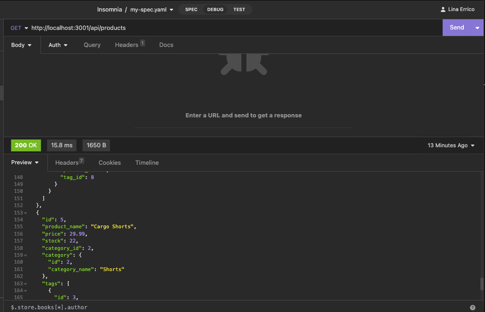
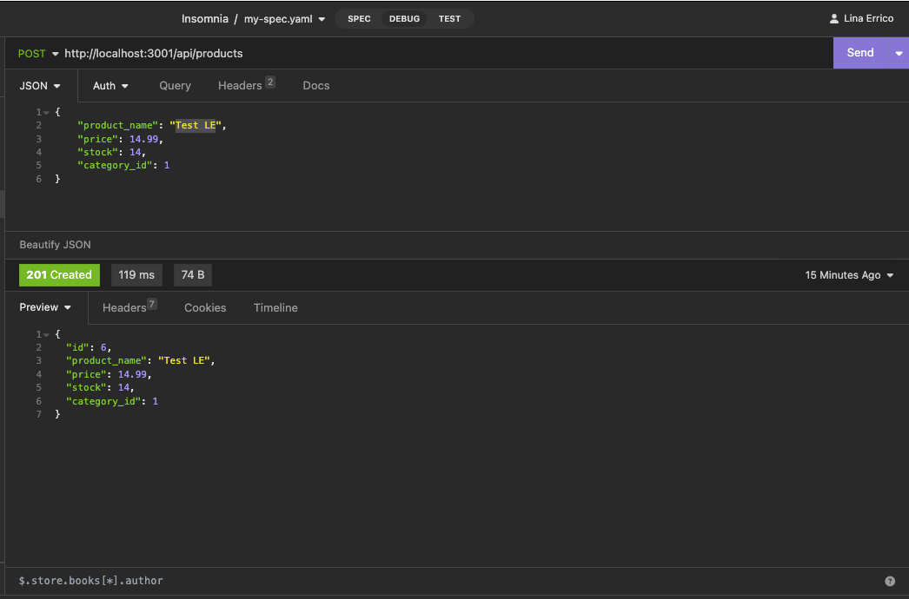
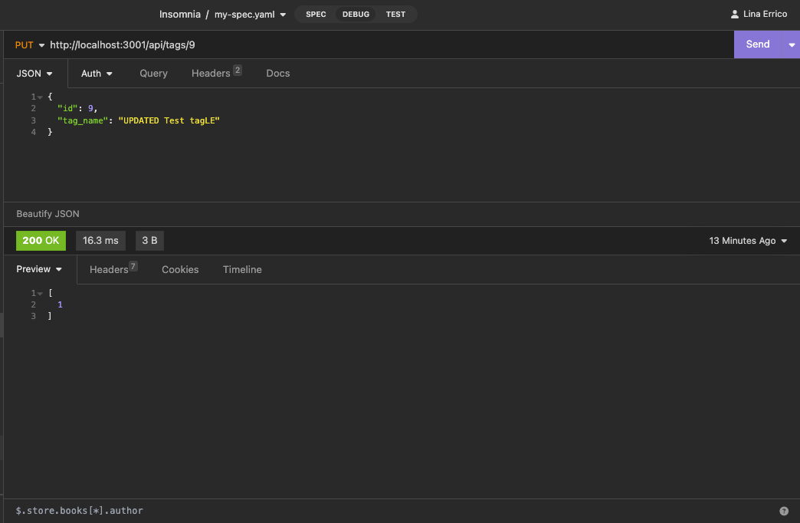
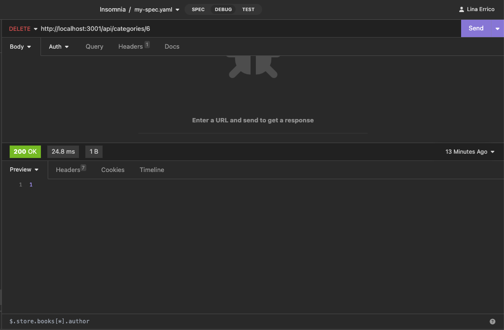

# E-commerce_Back_End

## Description

This project was created to build the back end for an e-commerce site, taking a working Express.js API and configuring it to use Sequelize to interact with a MySQL database. 

## Table of Contents
- [Description](#description)
- [Table of Contents](#table-of-contents)
- [Installation](#installation)
- [Usage](#usage)
- [License](#license)
- [Note](#note)

## Installation

N/A

## Usage

The link to the walkthrough video is https://drive.google.com/file/d/1EURQ2hgxL7s95piQXn18bR9z_nFhKW69/view

Application for adding, updating, consulting and deleting products, categories, and tags for an e-commerce database APIs.  

## License

## Note

This project was created based on reviewing activities from the previous classes at bootcamp and Google searches.

